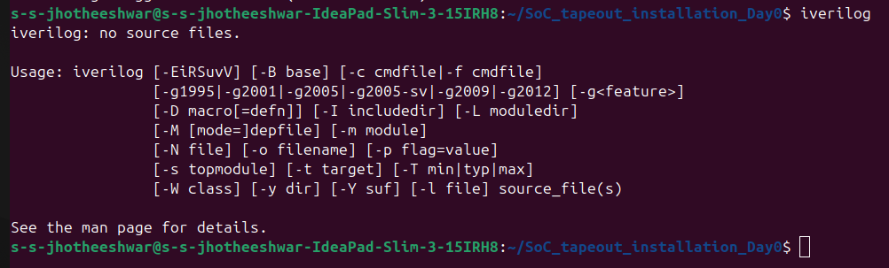
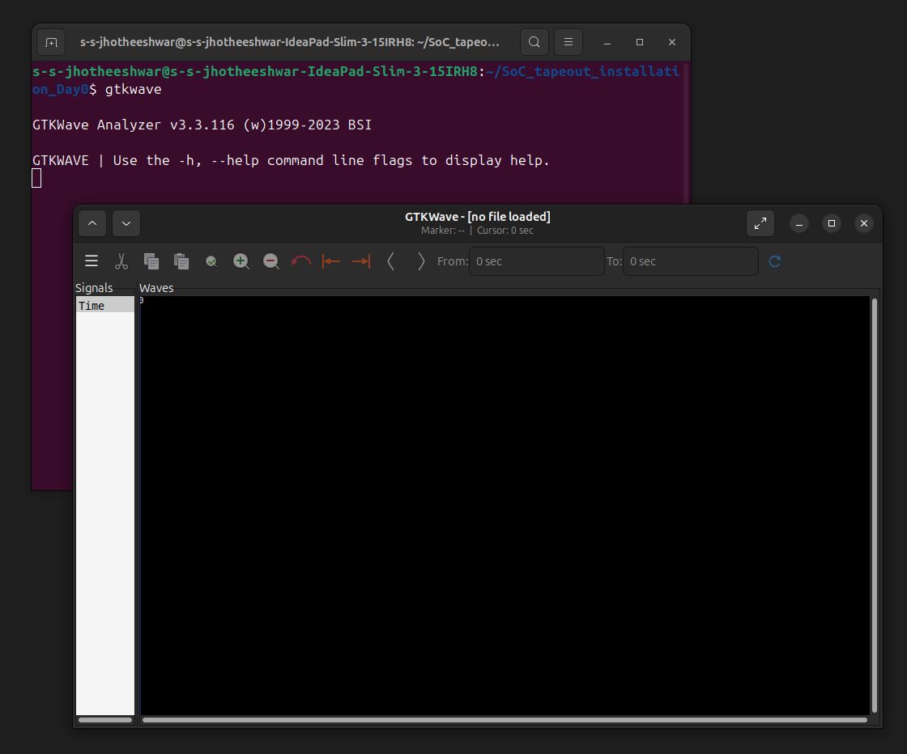
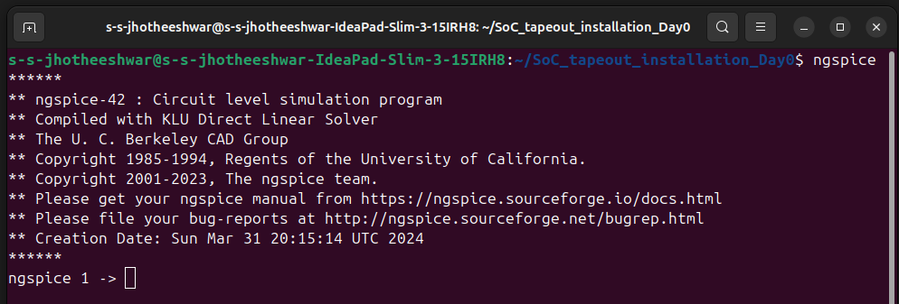
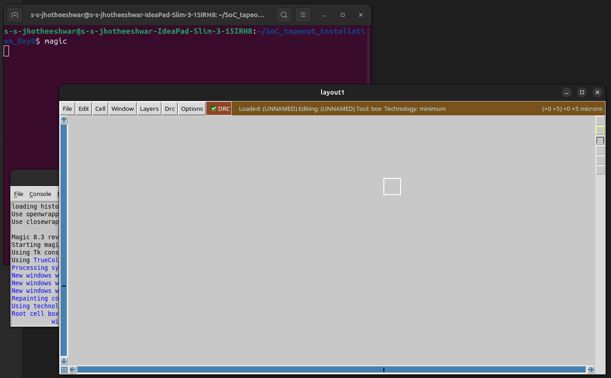
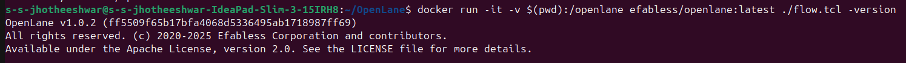

# 🛠 Tools Installation

This document contains the installation details of the essential tools required for the **VSD RISC-V SoC Tapeout Program** on Ubuntu Linux.

---

## 📌 Installed Tools

### 1. Yosys  

### 2. Icarus Verilog (iverilog)  

### 3. GTKWave  

### 4. Ngspice  
 

### 5. Magic VLSI  

## Checking versions 

## Openlane 

---

## ✅ Summary

The following tools are now installed and ready for use in the RTL-to-GDSII design flow:  
- **Yosys** → Synthesis  
- **Icarus Verilog (iverilog)** → RTL Simulation  
- **GTKWave** → Waveform Viewing  
- **Ngspice** → Circuit Simulation  
- **Magic VLSI** → Layout & Physical Design
- **OpenLane** → End-to-End RTL-to-GDSII Flow Automation  
