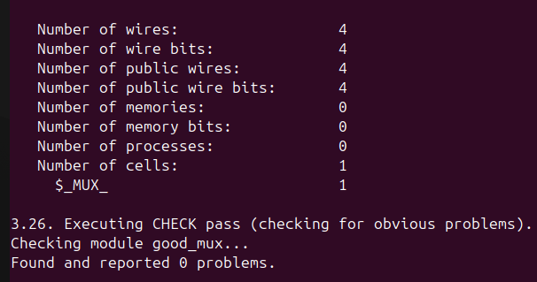
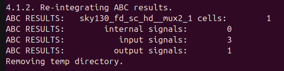
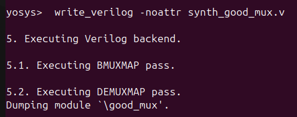
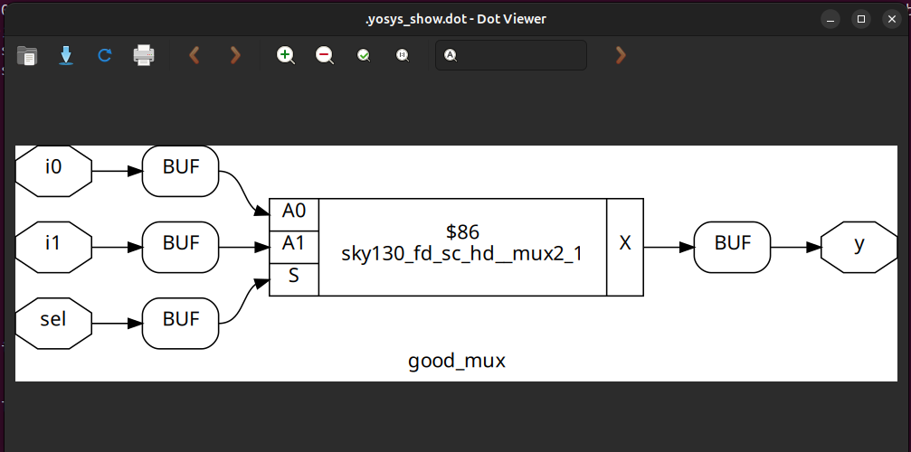

# 🚀 Day 1 – Verilog Simulation and Synthesis

## 📌 Tasks
1. Simulate a Verilog design using **Icarus Verilog (iverilog)**  
2. View output waveforms using **GTKWave**  
3. Synthesize the design with **Yosys**  

---

## 🔹 Step 1: Simulation with Icarus Verilog & GTKWave

### ➡️ Compile and Run Simulation
```bash
# Compile Verilog source and testbench
iverilog verilog_files/good_mux.v verilog_files/tb_good_mux.v

# Run the simulation (creates tb_good_mux.vcd if $dumpfile is present in testbench)
./a.out
```
📸 **Command Output:**  


---

### ➡️ View Waveform in GTKWave
```bash
# Open waveform in GTKWave
gtkwave tb_good_mux.vcd
```
📸 **Waveform Output:**  


---

## 🔹 Step 2: Synthesis with Yosys

### ➡️ Open Yosys and Load Libraries
```bash
# Open Yosys
yosys

# Load the Sky130 PDK standard cell library
yosys> read_liberty -lib lib/sky130_fd_sc_hd__tt_025C_1v80.lib
```
📸 **Command Output:**  


---

### ➡️ Read Verilog Design
```bash
yosys> read_verilog verilog_files/good_mux.v
```
📸 **Command Output:**  


---

### ➡️ Synthesize the Design
```bash
yosys> synth -top good_mux
```
📸 **Synthesis Log:**  


---

### ➡️ Map to Sky130 Standard Cells
```bash
yosys> abc -liberty lib/sky130_fd_sc_hd__tt_025C_1v80.lib
```
📸 **Mapping Output:**  


---

### ➡️ Write Gate-Level Netlist
```bash
yosys> write_verilog -noattr synth_good_mux.v
```
📸 **Command Output:**  


---

### ➡️ View Schematic
```bash
yosys> show
```
📸 **Yosys Schematic:**  


---

## 📝 Notes
- `read_liberty` loads the **cell library** (timing + gate info).  
- `synth` performs **RTL → gate-level synthesis**.  
- `abc` maps the design to **Sky130 standard cells**.  
- `write_verilog` saves the **gate-level netlist**.  
- `show` generates a **schematic diagram** inside Yosys.  

---

## 🎯 Summary
- ✅ **Icarus Verilog + GTKWave** → for functional simulation & waveform analysis.  
- ✅ **Yosys** → for synthesis and mapping to **Sky130 PDK**.  

---
