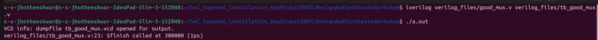
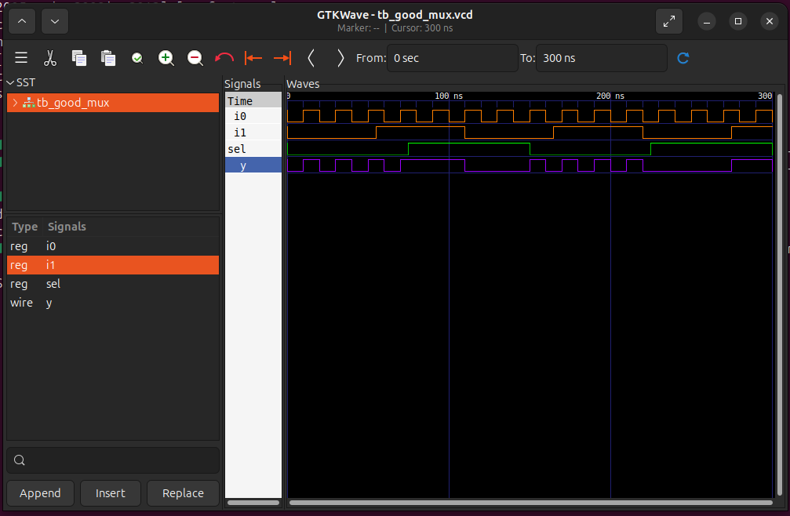
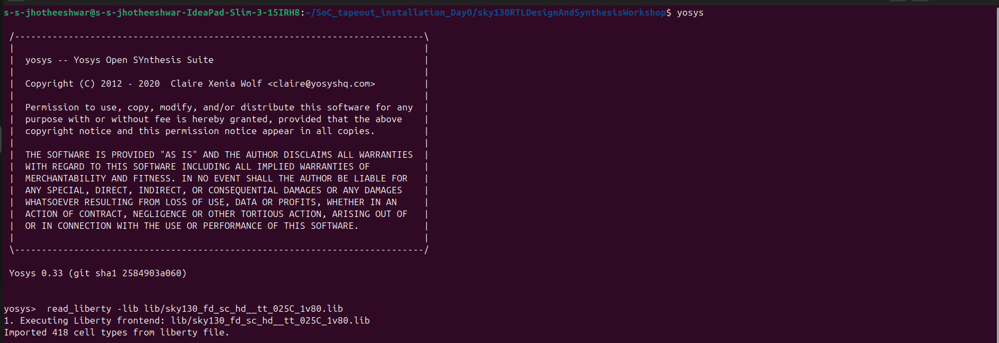
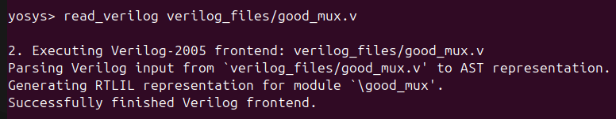

# Day 1 – Verilog Simulation and Synthesis

## 📌 Tasks
1. Simulate a Verilog design using **Icarus Verilog (iverilog)**  
2. View output waveforms using **GTKWave**  
3. Synthesize the design with **Yosys**

---

## 🔹 Steps

### 1. Simulation with Icarus Verilog and waveform through GTKWave
```bash
# Compile Verilog source and testbench
iverilog verilog_files/good_mux.v verilog_files/tb_good_mux.v

# Run the simulation (creates tb_good_mux.vcd if $dumpfile is present in testbench)
./a.out
```

---
```bash
# Open waveform in GTKWave
gtkwave tb_good_mux.vcd
```

---
### 2. Yosys Synthesis

```bash
# Open Yosys
yosys

# Load the Sky130 PDK standard cell library
yosys> read_liberty -lib lib/sky130_fd_sc_hd__tt_025C_1v80.lib
```

---
```bash

# Read the Verilog design file
yosys> read_verilog verilog_files/good_mux.v
```

---
```bash

# Synthesize the design (set top module as good_mux)
yosys> synth -top good_mux

# Map the design to Sky130 standard cells
yosys> abc -liberty lib/sky130_fd_sc_hd__tt_025C_1v80.lib

# Write synthesized gate-level netlist to file
yosys> write_verilog -noattr synth_good_mux.v

# View schematic diagram
yosys> show
```

---

## 📝 Notes
- `read_liberty` loads the **cell library** (timing + gate info).  
- `synth` performs **RTL → gate-level synthesis**.  
- `abc` maps the design to **Sky130 standard cells**.  
- `show` generates a **schematic diagram** inside Yosys.  

---

## 🎯 Summary
- ✅ **Icarus Verilog + GTKWave** → for functional simulation & waveform analysis.  
- ✅ **Yosys** → for synthesis and mapping to **Sky130 PDK**.  

---


