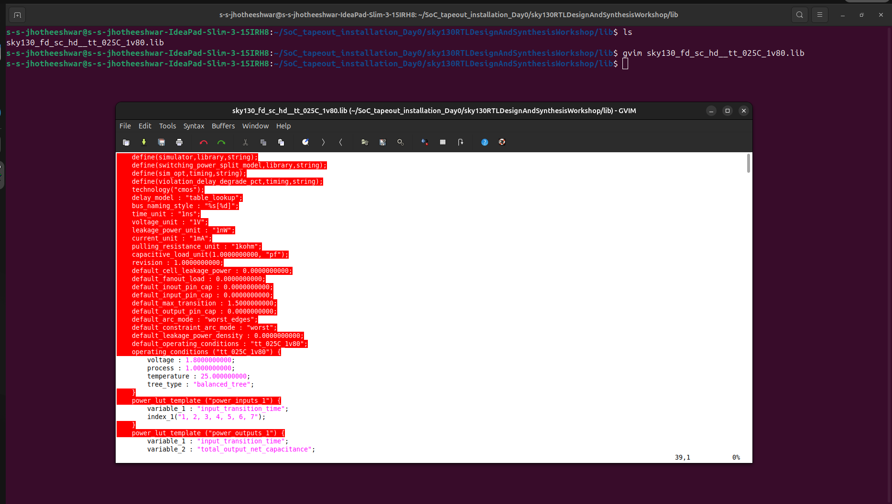
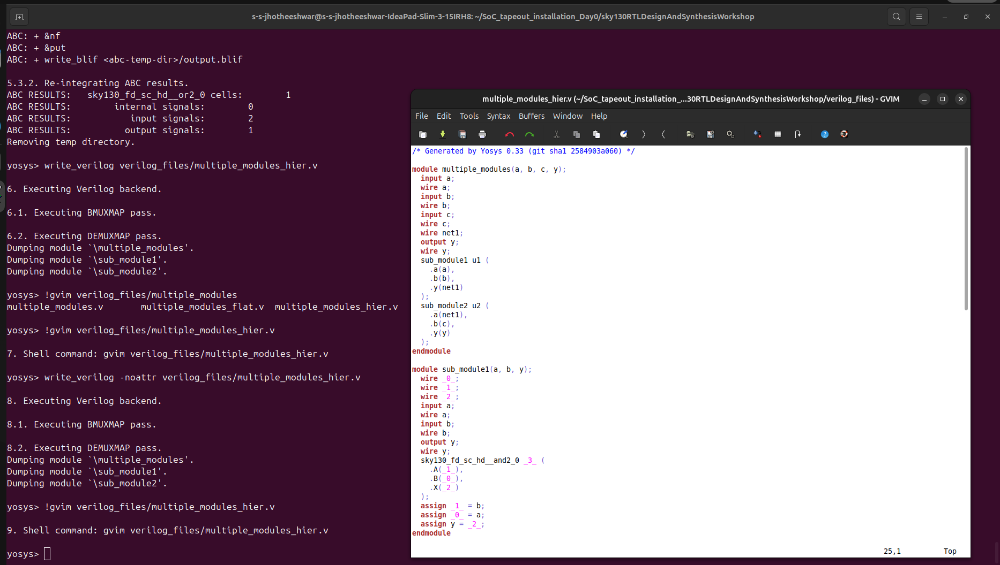
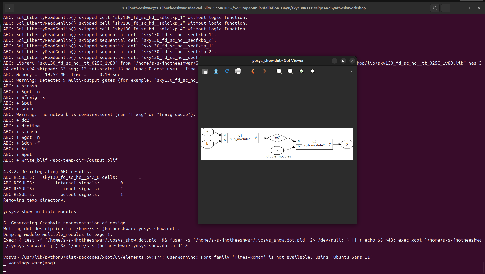
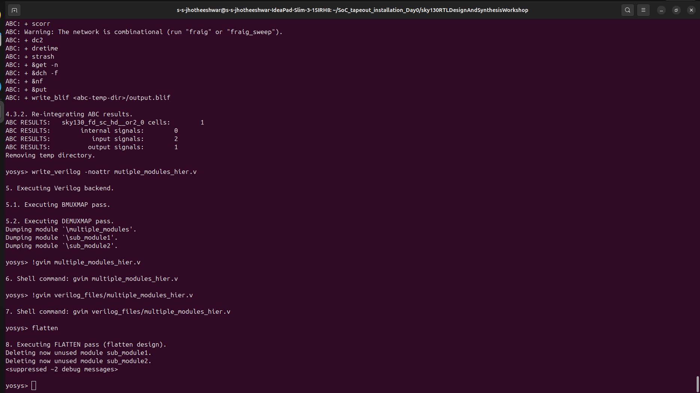

# 🚀 Day 2 – Verilog & Synthesis

## 📌 Tasks
1. Understand the **Sky130 Library**  
2. Learn about **Hierarchical vs. Flattened Synthesis**  
3. Explore different **Types of D Flip-Flops (DFFs)**  

---

## 🔹 1. Sky130 Library

### 📖 Overview
- **SkyWater SKY130 PDK** is an **open-source 130nm process design kit**.  
- Contains **standard cell libraries** for synthesis, simulation, and layout.  
- Includes logic gates, flip-flops, latches, and other building blocks.  

### 📝 Key Points
- `.lib` → Timing & power info (Liberty format).  
- `.lef` → Layout exchange format (geometry info).  
- `.gds` → Final layout for fabrication.  
- Used in **Yosys, OpenLANE, Magic, KLayout** flows.


---

## 🔹 2. Hierarchical vs. Flattened Synthesis

### 📖 Hierarchical Synthesis
- Preserves module hierarchy during synthesis.  
- Easier debugging & analysis.  
- Good for large designs.  

### 📖 Flattened Synthesis
- Breaks design into a single-level netlist.  
- May give better optimization results.  
- Harder to debug due to loss of hierarchy.  

### 📝 Comparison
| Feature                | Hierarchical | Flattened |
|------------------------|--------------|-----------|
| Readability            | ✅ Easy      | ❌ Hard   |
| Optimization           | ⚠️ Limited   | ✅ Better |
| Debugging              | ✅ Easier    | ❌ Harder |
| Design Reuse           | ✅ Possible  | ❌ No     |


example verilog file 
```verilog
module sub_module2 (input a, input b, output y);
	assign y = a | b;
endmodule

module sub_module1 (input a, input b, output y);
	assign y = a&b;
endmodule


module multiple_modules (input a, input b, input c , output y);
	wire net1;
	sub_module1 u1(.a(a),.b(b),.y(net1));  //net1 = a&b
	sub_module2 u2(.a(net1),.b(c),.y(y));  //y = net1|c ,ie y = a&b + c;
endmodule
```
Hierarchical Synthesis




Flattened Synthesis


---

## 🔹 3. Types of D Flip-Flops (DFFs)

### 📖 Asynchronous Reset DFF
```verilog
module dff_asyncres (input clk, input async_reset, input d, output reg q);
  always @ (posedge clk, posedge async_reset)
    if (async_reset)
      q <= 1'b0;
    else
      q <= d;
endmodule
```
- **Asynchronous reset**: Overrides clock, setting `q` to `0` immediately.  
- **Edge-triggered**: Captures `d` on rising clock edge if reset is low.  

---

### 📖 Asynchronous Set DFF
```verilog
module dff_async_set (input clk, input async_set, input d, output reg q);
  always @ (posedge clk, posedge async_set)
    if (async_set)
      q <= 1'b1;
    else
      q <= d;
endmodule
```
- **Asynchronous set**: Overrides clock, setting `q` to `1` immediately.  

---

### 📖 Synchronous Reset DFF
```verilog
module dff_syncres (input clk, input sync_reset, input d, output reg q);
  always @ (posedge clk)
    if (sync_reset)
      q <= 1'b0;
    else
      q <= d;
endmodule
```
- **Synchronous reset**: Takes effect **only** on the clock edge.  

---

## 🎯 Summary
- ✅ **Sky130 library** provides open-source standard cells for synthesis & layout.  
- ✅ **Hierarchical vs. Flattened synthesis** affects readability, optimization, and reuse.  
- ✅ **DFFs** can use **asynchronous set/reset** or **synchronous reset** depending on design needs.  

---
