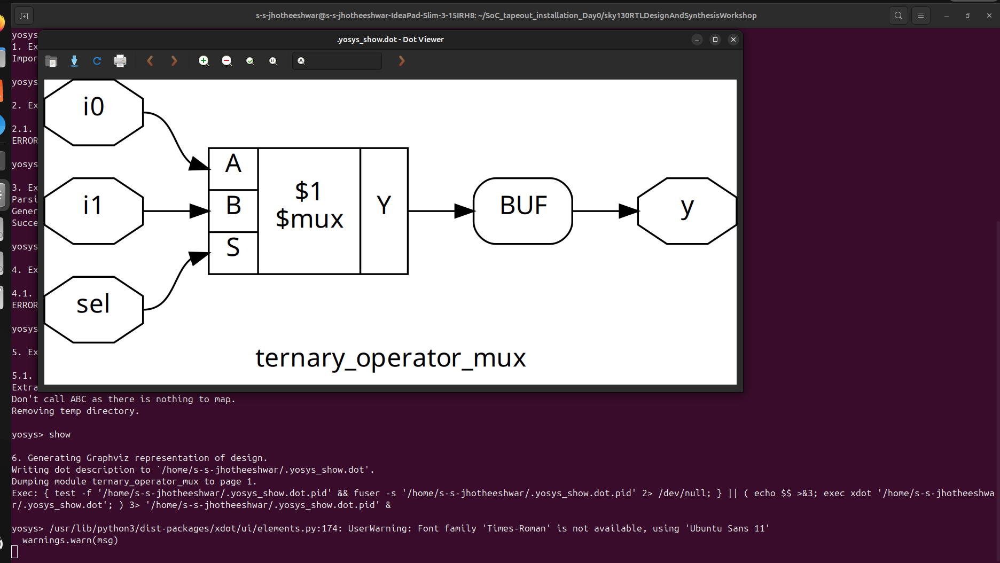
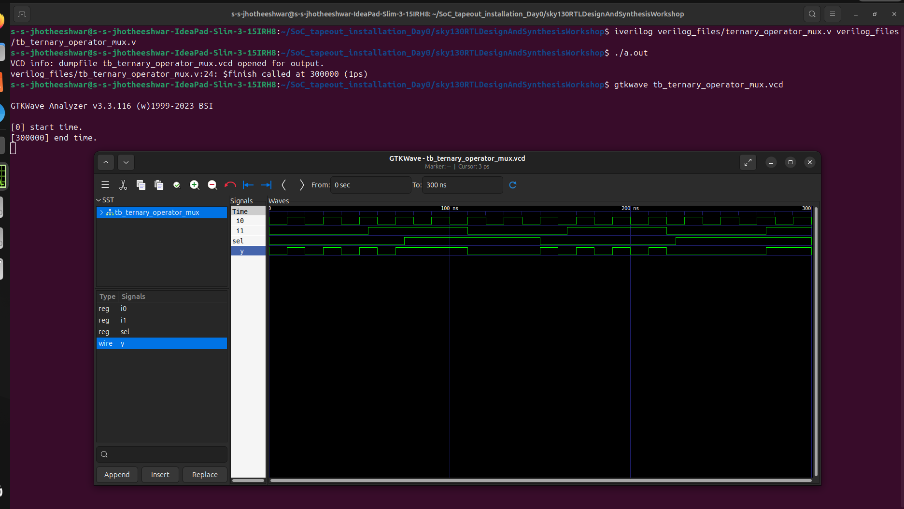
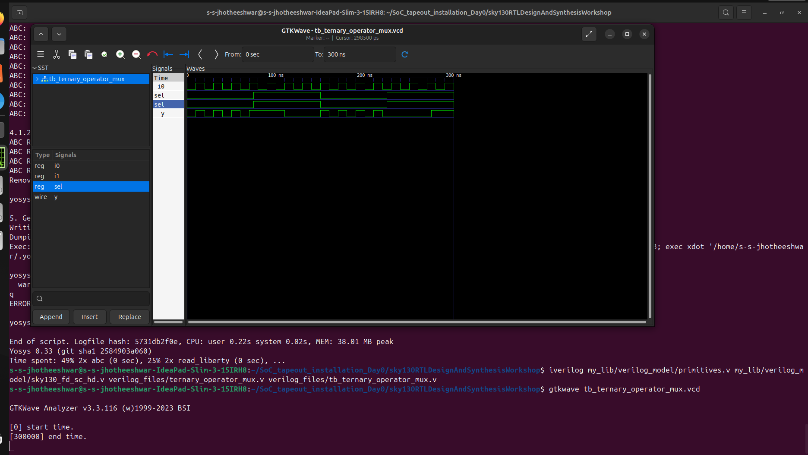
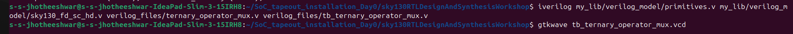

# Day 4 – Gate-Level Simulation (GLS) & Key Concepts
## 📌 Tasks

1.  Perform **Gate-Level Simulation (GLS)** using Sky130 standard cell library.
2.  Understand **Blocking vs. Non-Blocking assignments** in Verilog.
3.  Learn about **Synthesis–Simulation Mismatch** and how to avoid it.

-----

## 🔹 1. Gate-Level Simulation (GLS)

Gate-Level Simulation validates the **synthesized netlist** using the same testbench as RTL. It ensures functionality is preserved after synthesis.

### Steps:

```bash
# Compile with primitives + Sky130 standard cell models + synthesized netlist + testbench
iverilog /path/to/sky130_fd_sc_hd/verilog/primitives.v \
        /path/to/sky130_fd_sc_hd/verilog/sky130_fd_sc_hd.v \
        synth_good_mux.v \
        tb_good_mux.v -o gls_mux.out

# Run GLS
./gls_mux.out

# Open waveform in GTKWave
gtkwave tb_good_mux.vcd
```

✅ Make sure your netlist (`synth_good_mux.v`) is generated from Yosys using:

```yosys
yosys> write_verilog -noattr synth_good_mux.v
```

-----

## 🔹 2. Blocking vs. Non-Blocking Assignments

| Feature | **Blocking** (`=`) | **Non-Blocking** (`<=`) |
| :--- | :--- | :--- |
| **Execution** | Executes statements **sequentially**. Next statement waits until the current one finishes. | Executes statements **concurrently**. All updates happen at the end of the time step. |
| **Typical Use** | Used in **combinational logic**. | Used in **sequential logic** (flip-flops). |
| **Example** | `a = b; c = a;` // `c` gets updated only after `a = b` finishes. | `a <= b; c <= a;` // `c` gets the **old** value of `a`, not the updated one. |

✅ **Rule of thumb:**

  * Use **`=`** inside **combinational** `always` blocks.
  * Use **`<=`** inside **sequential** `always` blocks (`posedge clk`).

-----

## 🔹 3. Synthesis–Simulation Mismatch

A **synthesis–simulation mismatch** happens when simulation results differ from the synthesized hardware behavior.

### Causes:

  * Incorrect use of blocking/non-blocking.
  * **Latch inference** due to incomplete sensitivity lists or missing `else` in conditional logic.
  * Using **delays** (`#10`) in RTL (ignored during synthesis).
  * **Initial blocks** used for hardware initialization (not always synthesizable).

### How to Avoid:

  * Follow proper coding guidelines (**combinational** vs. **sequential** logic).
  * Avoid **`#`delays** in synthesizable RTL.
  * Ensure all signals are properly driven in **every branch** of logic (to avoid unintended latch inference).
  * Simulate both **RTL** and **GLS** to cross-check functionality.

-----

## 4. lab work





#### gate level simulation using generated netlist 

## 🎯 Summary

  * ✅ **GLS** checks the correctness of the **synthesized netlist** using standard cell models.
  * ✅ **Blocking (`=`)** $\rightarrow$ Combinational, sequential execution.
  * ✅ **Non-blocking (`<=`)** $\rightarrow$ Sequential logic, parallel execution.
  * ✅ **Mismatches** arise from coding mistakes $\rightarrow$ avoid with clean RTL practices.
