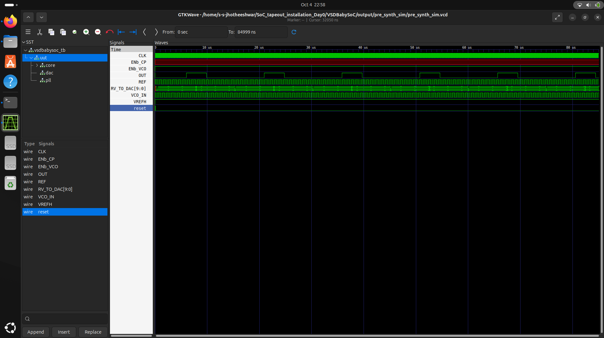
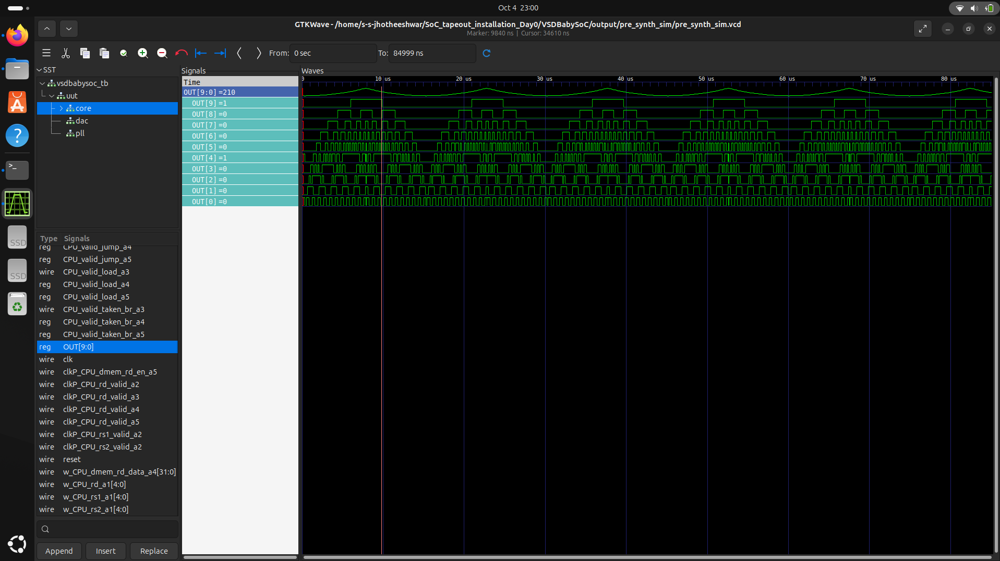
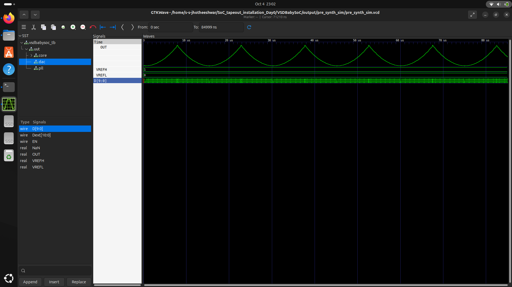

# ⚙️ VSDBabySoC — A Compact RISC-V Based System-on-Chip

> **An open-source educational SoC integrating a RISC-V core (RVMYTH), a Phase-Locked Loop (PLL), and a 10-bit DAC, built using Sky130 technology.**

---

## 🧩 Overview

**VSDBabySoC** is a compact **System-on-Chip (SoC)** that brings together digital and analog domains in a single design.  
It integrates:
- **RVMYTH** — a RISC-V-based CPU core written in TL-Verilog  
- **AVSDPLL** — a Phase-Locked Loop for precise clock generation  
- **AVSDDAC** — a 10-bit Digital-to-Analog Converter  

Together, these modules create a complete educational SoC that converts **digital computations into analog signals**, enabling output to devices like **audio systems, displays, or sensors**.

---

## 🧠 What is a System-on-Chip (SoC)?

A **System-on-Chip (SoC)** is an integrated circuit that houses the major components of a computing system — including processors, memory, input/output interfaces, and analog/mixed-signal blocks — on a single silicon die.

Modern examples include **Apple’s M-series** and **Qualcomm Snapdragon** chips, which integrate CPUs, GPUs, memory controllers, and connectivity modules.

SoCs offer:
- ✅ Compact design  
- ⚡ High performance  
- 🔋 Low power consumption  
- 🔗 Tight integration between analog and digital blocks  

---

## 🧱 Architecture — VSDBabySoC Components

| Module | Description | Repository Link |
|:--|:--|:--|
| 🧮 **RVMYTH (RISC-V Core)** | A TL-Verilog based RISC-V CPU that outputs 10-bit digital data. | [🔗 rvmyth](https://github.com/kunalg123/rvmyth) |
| ⏱️ **AVSDPLL (PLL)** | Generates a stable clock for synchronization and timing control. | [🔗 avsdpll](https://github.com/lakshmi-sathi/avsdpll_1v8.git) |
| 🎚️ **AVSDDAC (10-bit DAC)** | Converts 10-bit digital data from the CPU into an analog output. | [🔗 avsddac](https://github.com/vsdip/rvmyth_avsddac_interface.git) |
| 🧩 **VSDBabySoC (Top Module)** | Integrates all modules — the CPU, PLL, and DAC — into one SoC. | [🔗 VSDBabySoC](https://github.com/manili/VSDBabySoC.git) |

---


### 🔹 Step 1 - Compile the SoC

```bash
iverilog -o vsdbabysoc_tb.vvp vsdbabysoc.v testbench.v rvmyth.v avsdpll.v avsddac.v
```


### 🔹 Step 2 - View Waveforms

```bash
gtkwave pre_synth_sim.vcd
```

You’ll observe:

* PLL clock signals
* RISC-V core execution output
* DAC analog waveform output

---

## 🧠 Learning Outcomes

Through **VSDBabySoC**, you’ll understand:

* ✅ SoC architecture and modular design
* ⚙️ Clock generation using PLLs
* 🔁 Digital-to-analog interfacing
* 🧩 Integration of open-source IPs
* 🧰 End-to-end SoC design flow (RTL → Simulation → Synthesis)

This project bridges the gap between **digital logic** and **analog interfacing**, providing hands-on experience with **open-source VLSI tools** such as:

> Icarus Verilog • GTKWave • Yosys • Sky130 PDK


## running vsd baby soc

```bash
sudo apt update
sudo apt install python3-venv python3-pip
python3 -m venv sp_env
source sp_env/bin/activate
pip install pyyaml click sandpiper-saas

sandpiper-saas -i ./src/module/*.tlv -o rvmyth.v --bestsv --noline -p verilog --outdir ./src/module/
```
command to convert rvmyth.tlv to rvmyth.v

```bash 
mkdir -p output/pre_synth_sim

iverilog -o output/pre_synth_sim/pre_synth_sim.out \
  -DPRE_SYNTH_SIM \
  -I src/include -I src/module \
  src/module/testbench.v

cd output/pre_synth_sim
./pre_synth_sim.out
```
compiling 






## 🧰 Tools Used

| Tool                          | Purpose                |
| ----------------------------- | ---------------------- |
| **Icarus Verilog (iverilog)** | RTL Simulation         |
| **GTKWave**                   | Waveform Viewing       |
| **Makerchip / SandPiperTLV**  | TL-Verilog Compilation |

---

## 🏁 Conclusion

The **VSDBabySoC** project demonstrates the integration of a **RISC-V core**, **PLL**, and **DAC** into a unified mixed-signal SoC.
It serves as a stepping stone for learners exploring the world of **open-source chip design**, **RISC-V architecture**, and **digital-analog co-design**.

> 🧩 *“VSDBabySoC — bridging digital logic and analog reality, one open-source chip at a time.”*

---

