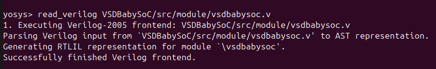

# Week 3 – Post-Synthesis Gate-Level Simulation (GLS) of BabySoC

## 🧠 Purpose of GLS
Gate-Level Simulation (GLS) is performed to verify the functionality of a design **after synthesis**.  
Unlike behavioral or RTL simulations, which operate at a higher abstraction level, GLS works on the **synthesized netlist**, consisting of actual gates and interconnections used to implement the design.

---

## ⚙️ Key Aspects of GLS for BabySoC

### 1. Verification with Timing Information
- GLS is performed using **Standard Delay Format (SDF)** files to ensure **timing correctness**.  
- It checks whether the SoC behaves as expected under **real-world timing constraints**.

### 2. Design Validation Post-Synthesis
- Confirms that the **logical behavior** of the BabySoC design remains consistent after synthesis.  
- Ensures that the design is **free from metastability, glitches, or timing issues**.

### 3. Simulation Tools Used
- **Synthesis Tool:** Yosys (or equivalent)
- **Simulation Tool:** Icarus Verilog (iverilog)
- **Waveform Viewer:** GTKWave

### 🔧 Synthesis using Yosys
```bash
yosys
```

### required commands 
```bash
yosys> read_verilog VSDBabySoC/src/module/vsdbabysoc.v
```

```bash
yosys> read_verilog -I VSDBabySoC/src/include/ VSDBabySoC/src/module/rvmyth.v
```

```bash
yosys> read_verilog -I VSDBabySoC/src/include/ VSDBabySoC/src/module/clk_gate.v
```

```bash
yosys> read_liberty -lib VSDBabySoC/src/lib/avsdpll.lib
```
```bash
yosys> read_liberty -lib VSDBabySoC/src/lib/avsddac.lib
```

```bash
yosys> read_liberty -lib sky130RTLDesignAndSynthesisWorkshop/lib/sky130_fd_sc_hd___tt_025C_1v80.lib
```

```bash
yosys> synth -top vsdbabysoc
```

```bash
yosys> abc -liberty sky130RTLDesignAndSynthesisWorkshop/lib/sky130_fd_sc_hd___tt_025C_1v80.lib -script +strash; scorr;ifraig;retime;{D};strash;dch, -f;map,-M,1,{D}
```

```bash
flatten
setundef -zero
clean -purge
rename -enumerate
```

```bash
write_verilog -noattr VSDBabySoC/output/vsdbabysoc.synth.v
```


