# Week 3 – Post-Synthesis Gate-Level Simulation (GLS) of BabySoC

## 🧠 Purpose of GLS
Gate-Level Simulation (GLS) is performed to verify the functionality of a design **after synthesis**.  
Unlike behavioral or RTL simulations, which operate at a higher abstraction level, GLS works on the **synthesized netlist**, consisting of actual gates and interconnections used to implement the design.

---

## ⚙️ Key Aspects of GLS for BabySoC

### 1. Verification with Timing Information
- GLS is performed using **Standard Delay Format (SDF)** files to ensure **timing correctness**.  
- It checks whether the SoC behaves as expected under **real-world timing constraints**.

### 2. Design Validation Post-Synthesis
- Confirms that the **logical behavior** of the BabySoC design remains consistent after synthesis.  
- Ensures that the design is **free from metastability, glitches, or timing issues**.

### 3. Simulation Tools Used
- **Synthesis Tool:** Yosys (or equivalent)
- **Simulation Tool:** Icarus Verilog (iverilog)
- **Waveform Viewer:** GTKWave

### 🔧 Synthesis using Yosys
```bash
yosys
```

### required commands 
```bash
yosys> read_verilog VSDBabySoC/src/module/vsdbabysoc.v
```

```bash
yosys> read_verilog -I VSDBabySoC/src/include/ VSDBabySoC/src/module/rvmyth.v
```
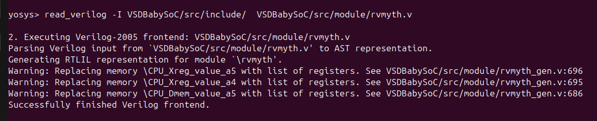
```bash
yosys> read_verilog -I VSDBabySoC/src/include/ VSDBabySoC/src/module/clk_gate.v
```
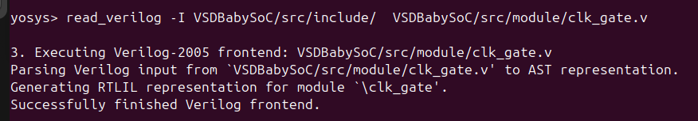
```bash
yosys> read_liberty -lib VSDBabySoC/src/lib/avsdpll.lib
```

```bash
yosys> read_liberty -lib VSDBabySoC/src/lib/avsddac.lib
```

```bash
yosys> read_liberty -lib sky130RTLDesignAndSynthesisWorkshop/lib/sky130_fd_sc_hd___tt_025C_1v80.lib
```
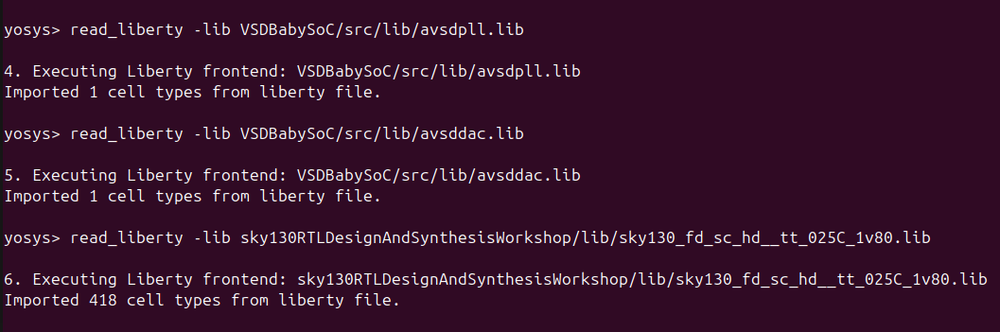
```bash
yosys> synth -top vsdbabysoc
```
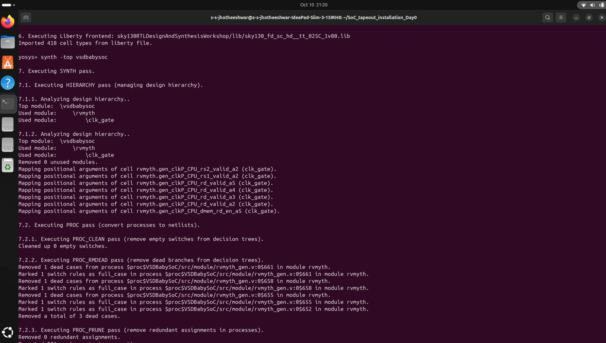
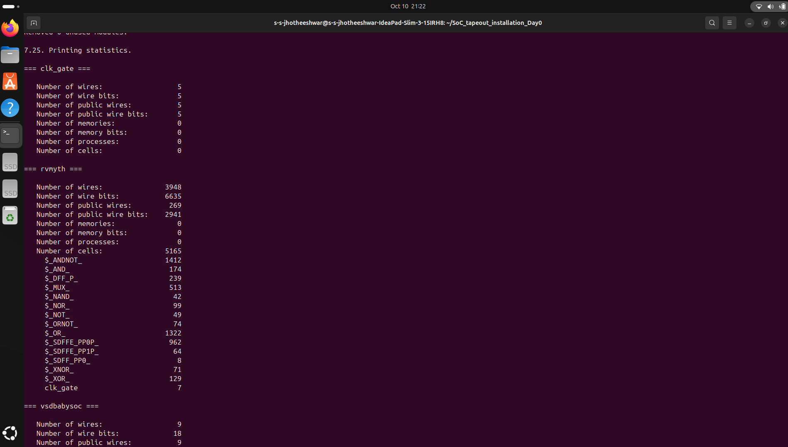
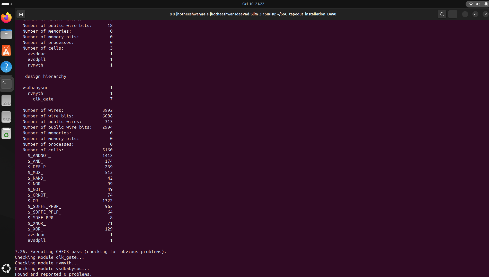
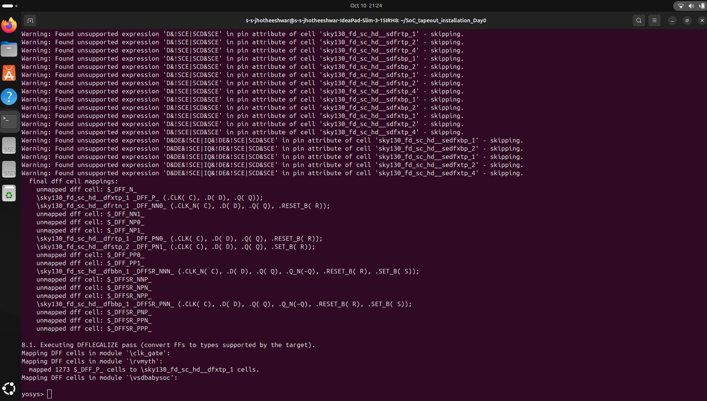
```bash
yosys> abc -liberty sky130RTLDesignAndSynthesisWorkshop/lib/sky130_fd_sc_hd___tt_025C_1v80.lib -script +strash; scorr;ifraig;retime;{D};strash;dch, -f;map,-M,1,{D}
```
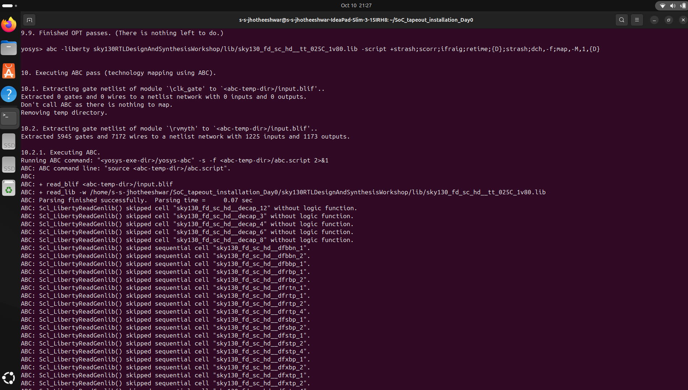
```bash
flatten
setundef -zero
clean -purge
rename -enumerate
stat
```
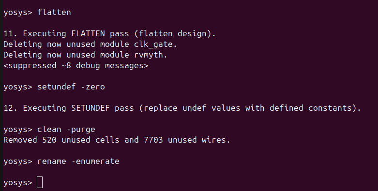
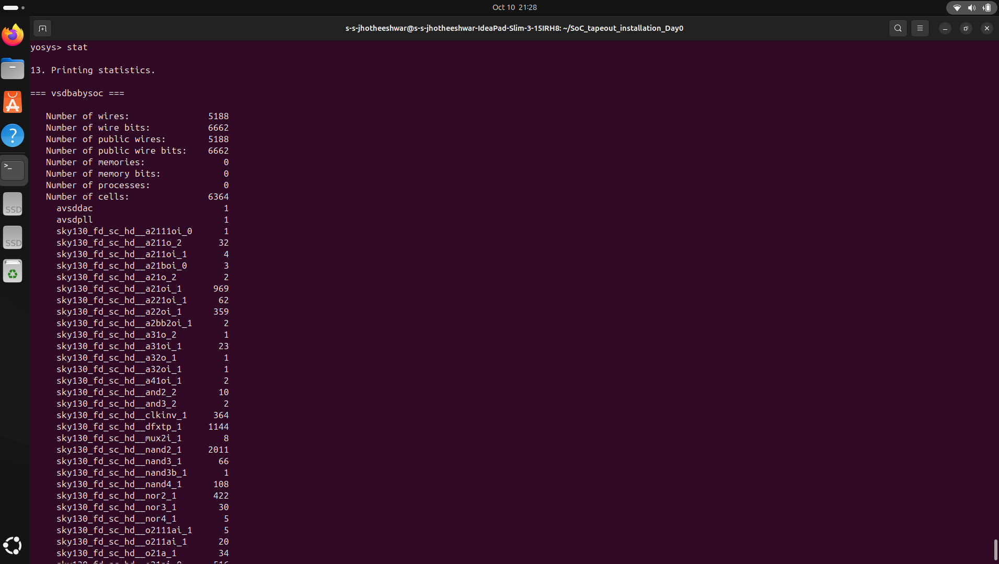
```bash
write_verilog -noattr VSDBabySoC/output/vsdbabysoc.synth.v
```
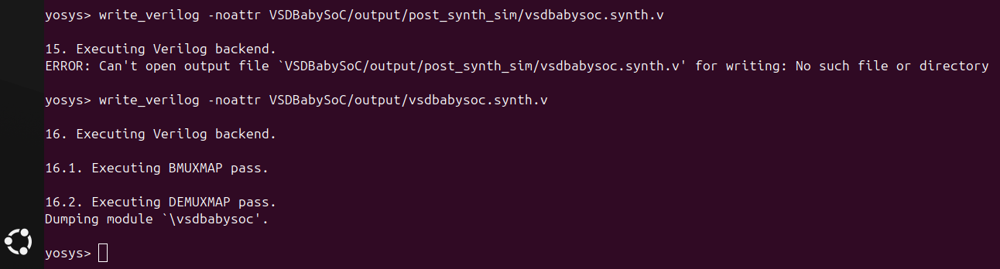

### post synth sim
```bash
iverilog -o VSDBabySoC/output/post_synth_sim.out -DPOST_SYNTH_SIM -DFUNCTIONAL -DUNIT_DELAY=#1 -I VSDBabySoC/src/include -I VSDBabySoC/src/module VSDBabySoC/src/module/testbench.v
```
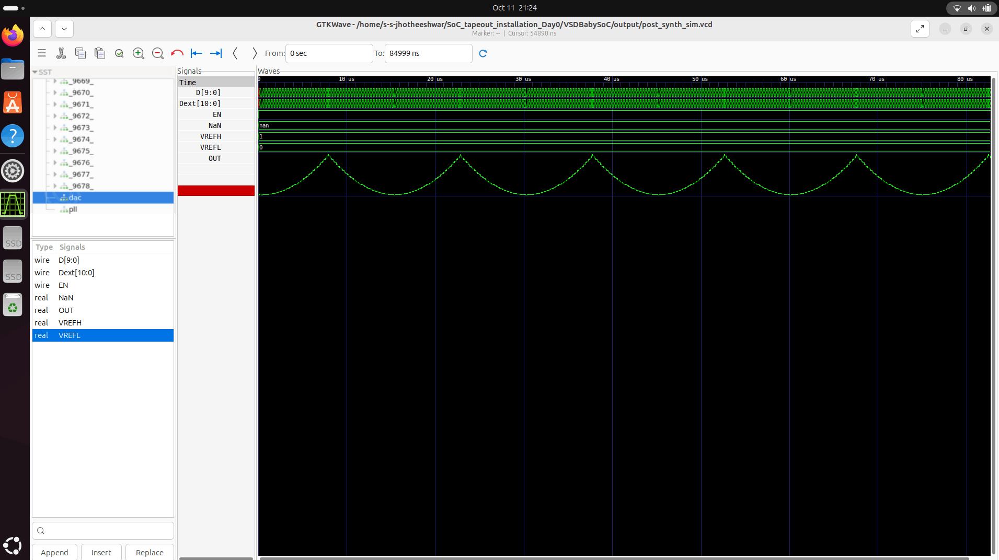


# 📊 Static Timing Analysis (STA) – Key Notes

## 🎯 Focus Areas
This document summarizes key points from the **STA course**, with emphasis on setup/hold checks, slack, clock definitions, and path-based analysis.

---

## ⚡ Setup and Hold Checks
- **Setup Time (Tsetup)**: Minimum time data must be stable **before** the clock edge.  
- **Hold Time (Thold)**: Minimum time data must remain stable **after** the clock edge.  
- Violations can cause **metastability** or incorrect data capture.  
- **STA** verifies that all flip-flops meet setup and hold requirements.

---

## ⏱ Slack
- **Slack** = Available time − Required time  
- **Positive Slack**: Timing constraints are met.  
- **Negative Slack**: Timing violations; circuit may fail at target frequency.  
- Calculated for each path in the design (setup and hold paths separately).  

---

## 🕒 Clock Definitions
- Define **clock sources** in STA:
  - Frequency / Period  
  - Duty cycle  
  - Source of clock (PLL, external oscillator, etc.)  
- **Clock uncertainty/jitter** is considered to ensure reliable timing checks.  
- Multiple clocks: Must define **relationships and interactions** (multicycle paths, clock domains).

---

## 🔗 Path-Based Analysis
- STA analyzes timing **between sequential elements** (flip-flops, latches).  
- Steps in path-based analysis:
  1. Identify all paths from **startpoint** to **endpoint**.  
  2. Calculate **arrival time** and **required time** at endpoint.  
  3. Compute **slack** for each path.  
- Types of paths:
  - **Setup paths** → Must meet setup constraints.  
  - **Hold paths** → Must meet hold constraints.  
  - **Multicycle paths** → Paths with more than one clock cycle to propagate data.  
- Critical paths are those with **minimum positive slack** or **negative slack**.

---

## ✅ Summary
- STA ensures **timing correctness** without running dynamic simulations.  
- Key outputs: Setup/Hold slack, critical paths, timing violations.  
- Helps **optimize circuit timing** and ensure reliable operation at target frequencies.  
- Considerations include:
  - Process, Voltage, Temperature (PVT) variations  
  - Clock definitions and uncertainties  
  - Path-based timing checks across all sequential elements  


## lab work for opensta
```bash
git clone https://github.com/The-OpenROAD-Project/OpenSTA.git
cd OpenSTA
```

```bash
docker build --file Dockerfile.ubuntu22.04 --tag opensta .

```

```bash
docker run -i -v $HOME:/data opensta
```
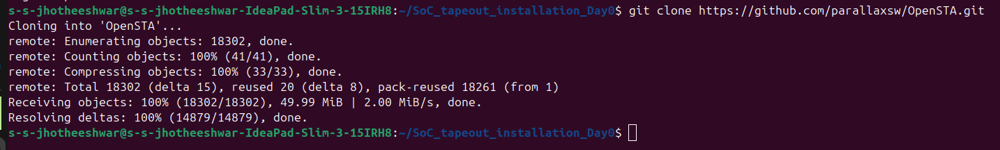
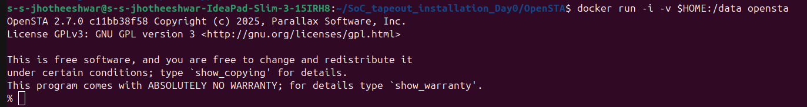


