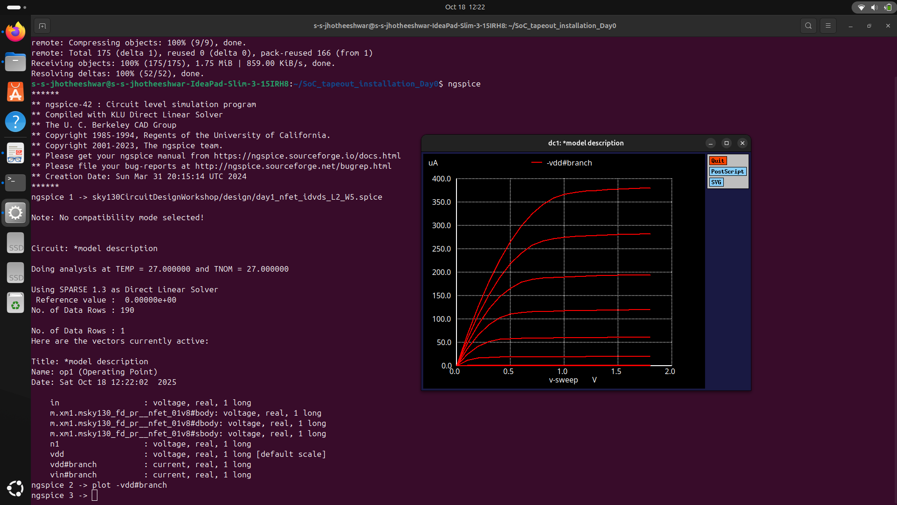
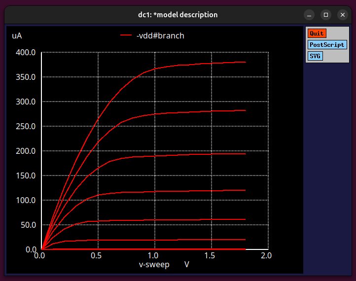

# 📘 Week 4 - Day 1: Introduction to SPICE Simulation

## 🔍 What is SPICE?
- **SPICE** stands for **Simulation Program with Integrated Circuit Emphasis**.  
- It is a **circuit simulation tool** used to analyze and verify electronic circuit behavior before fabrication.  
- Widely used in **analog and digital circuit design**, especially for **CMOS technology**.

## ⚙️ Why SPICE is Important in CMOS Circuit Design
- Helps **model transistor-level behavior** accurately (MOSFET characteristics).  
- Allows **verification of voltage, current, and timing** responses under different conditions.  
- Detects **design errors early** — saves cost and time before physical implementation.  
- Enables **parametric analysis** (like varying supply voltage, temperature, or transistor size).  
- Supports **DC, AC, and Transient simulations** to observe steady-state and dynamic responses.  

## 🧩 Applications
- Used for **inverter, amplifier, and logic gate analysis**.  
- Essential in **VLSI and mixed-signal design** workflows.  
- Helps in **characterizing performance** (e.g., delay, power, gain, noise margin).

## 🔬 lab work 
### N-FET characteristics
- To observe how the drain current (ID) varies with drain-source voltage (VDS) for a fixed gate-source voltage (VGS).

```bash
ngspice day1_nfet_idvds_L2_W5.spice
plot -vdd#branch
```



- x-axis -> Vds | y-axis -> Id | each red line has a different Vgs value 

## 🧠 Summary
SPICE simulation is a powerful tool that bridges the gap between **theory and real circuit behavior**, making it a cornerstone in **CMOS and VLSI design verification**.  
It also helps in **analyzing transistor characteristics**, such as plotting **VDS vs ID** curves for different **VGS** values in an **NMOS transistor**, which illustrates how the device operates in **linear and saturation regions**.

---

