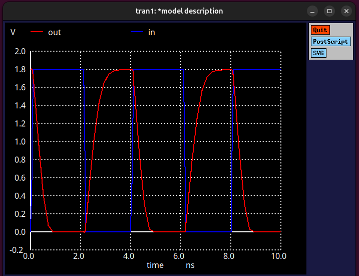

# Day 3: SPICE Simulation of CMOS Inverter

## 🔍 Objective
To simulate and analyze the **Voltage Transfer Characteristics (VTC)** and **transient response** of a **CMOS inverter** using SPICE.

---

## ⚙️ Device Parameters
- **Technology:** Sky130 (1.8 V)
- **NMOS Width (Wn):** 0.36 µm  
- **PMOS Width (Wp):** 0.84 µm  
- **Load Capacitance (CL):** 50 fF  

---

## 🧪 Part 1: DC Analysis — Voltage Transfer Characteristics (VTC)
- A **DC sweep** is performed to observe the **VTC curve** of the CMOS inverter.  
- The input voltage (Vin) is gradually varied from **0 V to 1.8 V**.  
- The output voltage (Vout) is measured to analyze:
  - **Switching threshold voltage (Vm)**
  - **Noise margins**
  - **Voltage levels for logic ‘0’ and ‘1’**

**Purpose:**  
To understand how the inverter transitions between logic states and identify its switching point.

---

## ⚡ Part 2: Transient Analysis — Dynamic Response
- **Time Step:** 1 ns  
- **Total Simulation Time:** 10 ns  
- A **pulsed input** is applied to the inverter.  
- The output waveform is observed to analyze **switching speed** and **delay**.

**Purpose:**  
To verify how the **CMOS inverter** responds dynamically to a changing input and how the **capacitive load (50 fF)** affects rise and fall times.

---

## 🧠 Summary
This experiment simulates a **CMOS inverter** built using **Sky130 1.8 V transistors**.  
- The **DC analysis** gives the static transfer curve (VTC).  
- The **transient analysis** shows how the inverter output switches between logic levels over time.  
Together, these results provide a clear understanding of the inverter’s **steady-state and dynamic performance**.

