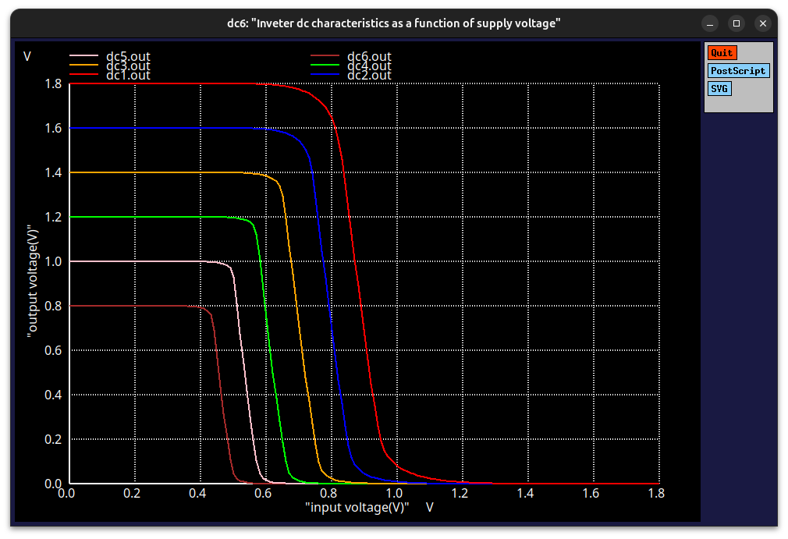
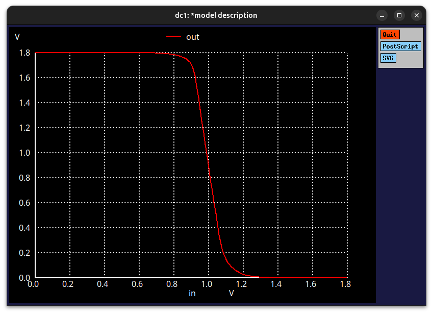

# Day 5: CMOS Inverter VTC Variation with Supply Voltage

## 🔍 Objective
To study how the **Voltage Transfer Characteristic (VTC)** of a **CMOS inverter** changes as the **supply voltage (Vdd)** is varied.

---

## ⚙️ Device Parameters
- **Technology:** Sky130 (1.8 V)
- **PMOS Width (Wp):** 1 µm  
- **NMOS Width (Wn):** 0.36 µm  
- **Load Capacitance (CL):** 50 fF  

---

## 🧪 Analysis
- The **supply voltage (Vdd)** is varied from **1.8 V down to 0.8 V**, in steps of **0.2 V**.  
- For each Vdd value, a **DC sweep** is performed to obtain the **Vout vs Vin (VTC)** curve.  

**Observations:**
- As **Vdd decreases**,  
  - The **logic levels (output high and low)** move closer together.  
  - The **switching threshold** shifts slightly.  
  - The **transition slope** becomes less steep — indicating **reduced inverter gain**.  

---

## 🧠 Summary
This experiment demonstrates how the **power supply voltage** directly affects the **noise margins**, **gain**, and **switching behavior** of a CMOS inverter.  
Lowering **Vdd** reduces the inverter’s performance and makes logic levels less distinct, emphasizing the importance of proper **supply voltage selection** in digital circuit design.

## 🧪 Part 2: Effect of Transistor Sizing on CMOS Inverter VTC

## Device Parameters
- **PMOS Width (Wp):** 7 µm  
- **NMOS Width (Wn):** 0.42 µm  
- **Load Capacitance (CL):** 50 fF  

## Analysis
- Perform a **DC sweep** of input voltage (**Vin**) to obtain **Vout vs Vin (VTC)**.  
- Observe the effects of **changing transistor widths** on inverter behavior:

**Observations:**
- Increasing **PMOS width** → stronger pull-up → inverter **switches earlier**.  
- Increasing **NMOS width** → stronger pull-down → faster fall time.  
- **Drive strength**, **switching point**, and **transition speed** are influenced by transistor sizes.

## 🧠Summary
Transistor sizing is crucial for **balancing CMOS inverter performance**:  
- A wider PMOS improves **pull-up strength** and shifts the switching threshold higher.  
- A wider NMOS improves **pull-down strength** and reduces delay.  
These adjustments help optimize **logic levels, gain, and speed** of digital circuits.

