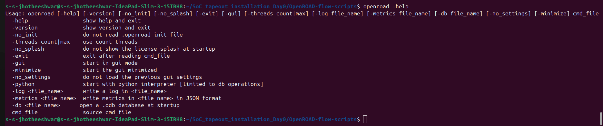
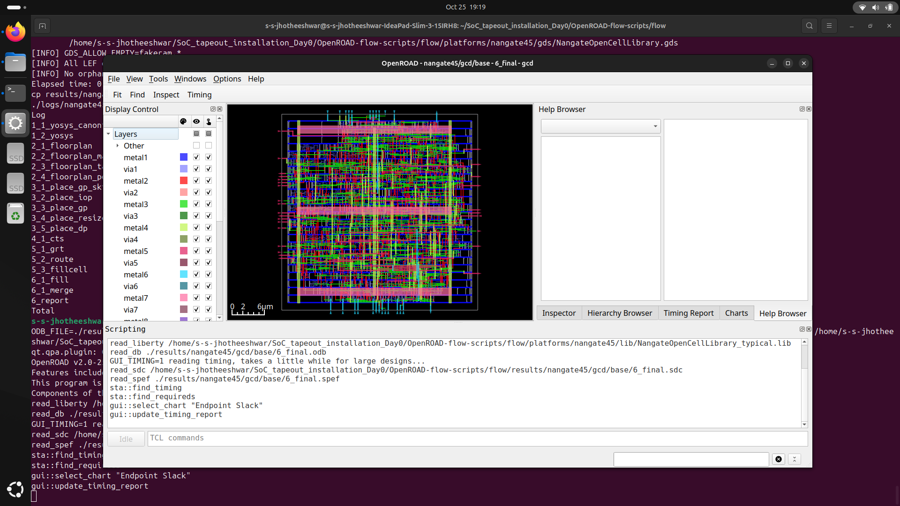

# Week 5 – OpenROAD Flow: Floorplan & Placement
## 🎯 Objective

The goal of Week 5 is to install and run the OpenROAD flow to generate a floorplan and placement. This includes:
- Setting up the OpenROAD environment
- Running the flow scripts
- Visualizing the layout in the GUI

## 🛠️ 1. OpenROAD Installation

### Clone the Repository
```bash
git clone https://github.com/The-OpenROAD-Project/OpenROAD-flow-scripts.git
cd OpenROAD-flow-scripts
```
### Setup OpenROAD
```bash
sudo ./setup.sh
```

### Build OpenROAD
```bash
./build_openroad.sh --local
```

### Verify Environment Setup
```bash
source ./env.sh
openroad -help

```

---

## 📂 2. Flow Execution & GUI Visualization

### Navigate to Design Flow Directory
```bash
cd <path-to-makefile-flow-directory>
make
```

### Launch GUI for Final Design
```bash
make gui_final
```


### Observations in GUI
- Floorplan generated for the `gcd` module
- Standard cells placed successfully
- Wires and interconnects visible in 2D layout

### Terminal Logs Confirmed
- `Floorplan stage completed`
- `Placement stage completed`
- `Core area: <value>`
- `Die dimensions: <value>`

---

## 📝 3. Summary

- Successfully installed and verified OpenROAD environment
- Executed flow using `make gui_final`
- Verified floorplan and placement stages
- Standard cells placed and core area calculated

---


