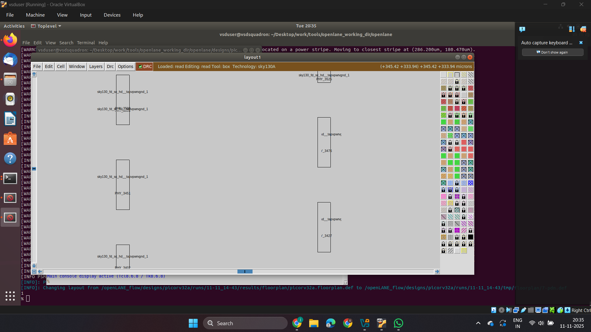

# Week 6 – Day 1: OpenLane Workflow – PicoRV32 Floorplanning & Placement

## 🛠️ Overview
This repository documents the Day 1 progress of Week 6 in the VLSI physical design workflow using OpenLane. The focus is on floorplanning and placement stages for the RISC-V-based PicoRV32 core.

## 📁 Project Structure
```
week6/
└── day1/
    ├── floorplan/
    ├── power_planning/
    ├── pin_placement/
    ├── synthesis/
    └── placement/
```

## 🚀 Objectives
- Understand and execute chip floorplanning in OpenLane
- Perform power planning and pin placement
- Run synthesis and floorplan stages for PicoRV32
- Complete the placement stage and analyze results

## 🧩 Steps Performed

### 1. 🧠 Synthesis
- Synthesized PicoRV32 RTL using Yosys
- Analyzed timing and area reports
- Verified netlist integrity before floorplan

  
### 2. 🔲 Chip Floorplanning
- Defined core and die area
- Set aspect ratio and core utilization
- Configured floorplan parameters in `config.tcl`

### 3. ⚡ Power Planning
- Added power and ground rails
- Verified power distribution network (PDN)
- Used `pdn.tcl` for custom power grid setup

### 4. 📌 Pin Placement
- Assigned I/O pins to specific edges
- Used `pin_order.cfg` for deterministic placement
- Verified pin accessibility and spacing

### 5. 🏗️ Running Floorplan in OpenLane
- Executed `run_floorplan` stage
- Generated DEF and LEF files
- Visualized layout using `openroad` GUI

### 6. 🧱 Placement Stage
- Ran global and detailed placement
- Checked for overlaps and congestion
- Generated final placed DEF for routing

## 📷 Screenshots





## 📌 Notes
- Target core: `picorv32`
- OpenLane version: *specify version used*
- Technology: *e.g., Sky130A*


