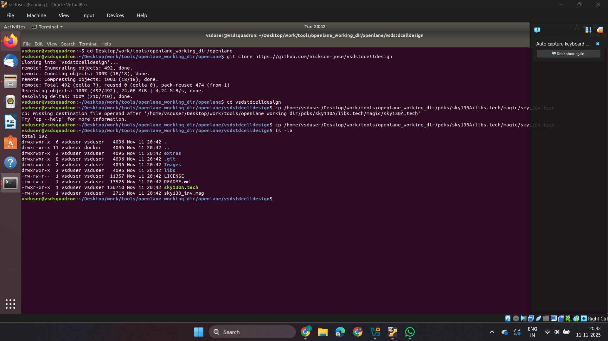
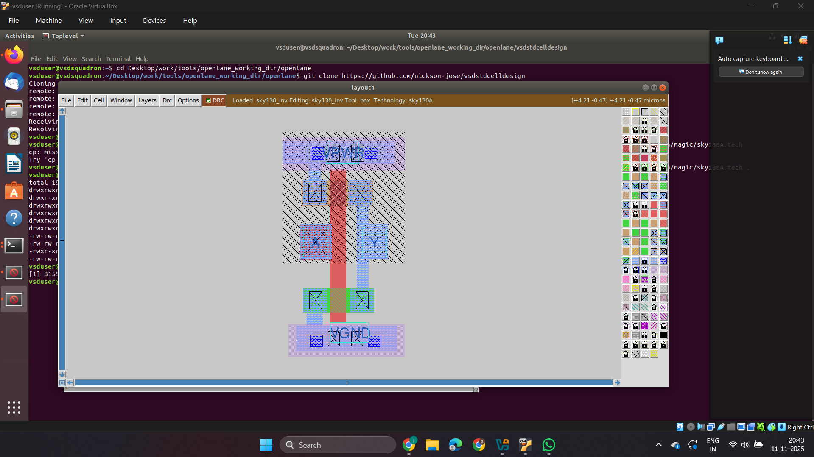
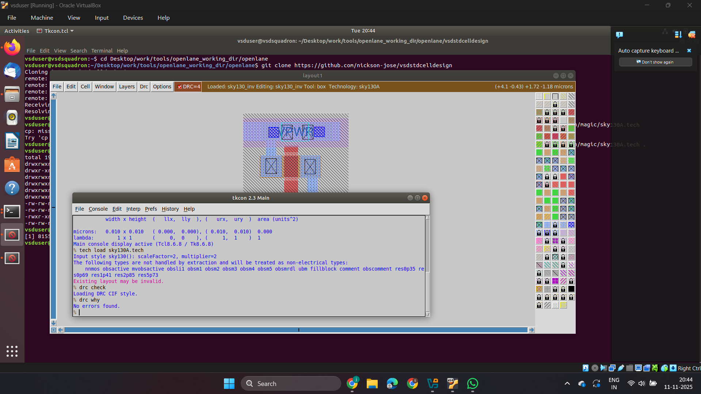
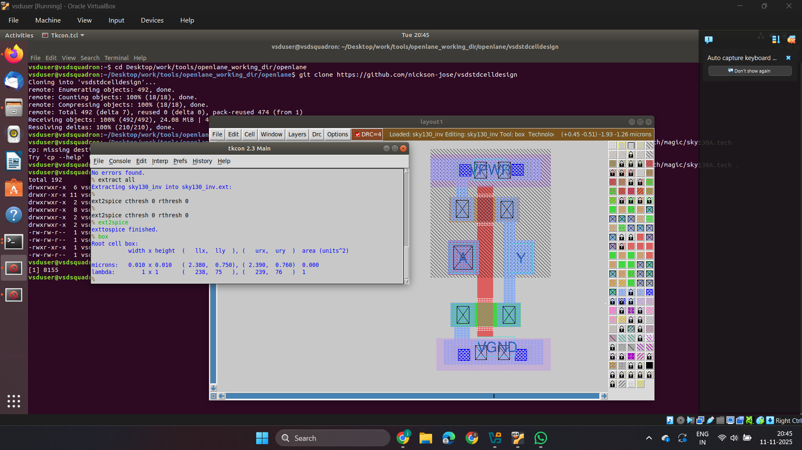
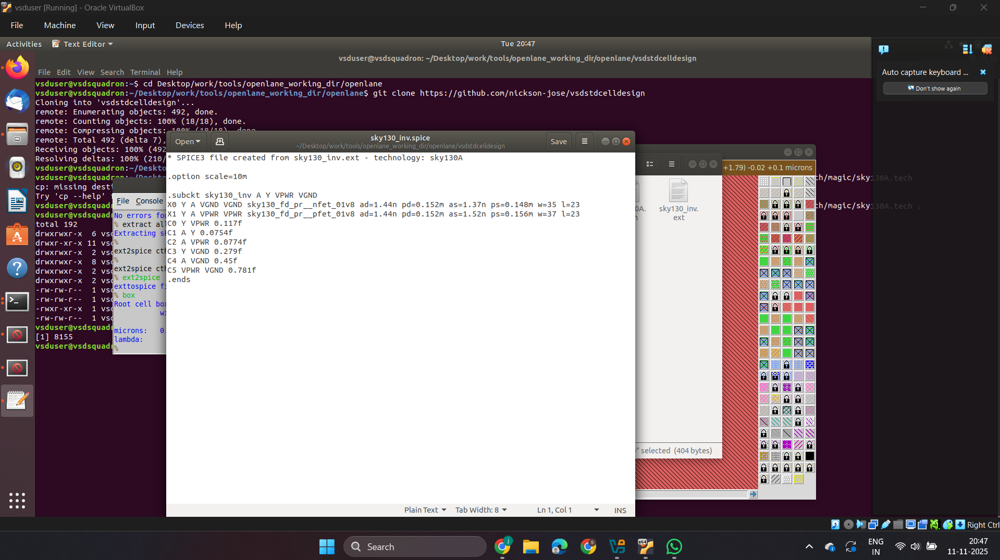

#  Day 3 — Custom Library Cell Design using Magic & NGSPICE

This session focuses on designing a **CMOS Inverter Layout from scratch** using **Magic VLSI**, extracting its SPICE netlist, and performing a **transient (time-domain) simulation** in **NGSPICE**.

---

## 🧱 Objective

- Design a **custom standard cell (CMOS Inverter)** layout in **Magic**  
- Extract the **SPICE netlist** from the layout  
- Edit the SPICE file to include **power rails, input signals**, and **transient simulation** commands  
- Verify the **inverter behavior** using NGSPICE waveform output  

---

## 🧰 Tools Used

| Tool         | Purpose                                           |
|--------------|---------------------------------------------------|
| **Magic**    | Layout design, DRC/LVS checks, and SPICE extraction |
| **NGSPICE**  | Circuit-level simulation and waveform analysis     |
| **SKY130 PDK** | Process Design Kit providing transistor models     |

---

## 🧩 Steps Involved

### 🏗️ 1. Create CMOS Inverter Layout in Magic

Launch Magic with SKY130 PDK:

```bash
magic -T sky130A.tech
```

Draw:

- **PMOS** (connected to VDD)  
- **NMOS** (connected to GND)  
- Common drain node as **Output (Y)**  
- **Input (A)** connected to both transistor gates  

Label the terminals as:

```
A   → Input  
Y   → Output  
VDD → Power  
GND → Ground  
```

---

### 📄 2. Extract SPICE Netlist

After layout DRC check, run:

```bash
extract all
ext2spice cthresh 0 rthresh 0
ext2spice
```

This generates a file like:

```
inverter.spice
```

---

### ✏️ 3. Editing SPICE for Transient Simulation

Open the generated `.spice` file and modify it as below:

```spice
* CMOS Inverter Transient Simulation
.include sky130_fd_pr__model__mos.spice

VDD vdd 0 1.8V
VIN in 0 PULSE(0 1.8 0 10p 10p 2n 4n)

X1 out in vdd 0 inv

.tran 0.01n 20n
.control
run
plot v(in) v(out)
.endc

.subckt inv out in vdd gnd
M1 out in vdd vdd vdd pmos w=1.0u l=0.15u
M2 out in in gnd gnd nmos w=0.5u l=0.15u
.ends inv
```

🟢 **Explanation:**

- `.include` → includes transistor models from SKY130 PDK  
- `VDD` → defines supply voltage  
- `VIN` → creates pulse waveform for input  
- `.tran` → sets transient analysis parameters  
- `.control ... .endc` → NGSPICE interactive commands for plotting  

---

### 🔍 4. Run Simulation in NGSPICE

```bash
ngspice inverter.spice
```

Then in the NGSPICE console:

```
plot v(in) v(out)
```

✅ You should see a **logic inversion waveform**, confirming correct inverter operation.

---

## lab work





## 🧪 Key Results

- CMOS Inverter Layout successfully created  
- SPICE extracted and modified for transient simulation  
- Output waveform shows proper inverter behavior (logic ‘1’ → ‘0’ and vice versa)  

---


